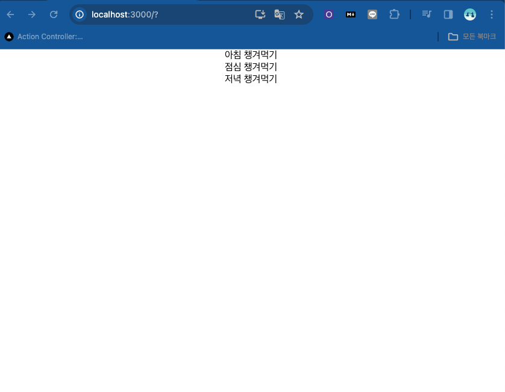
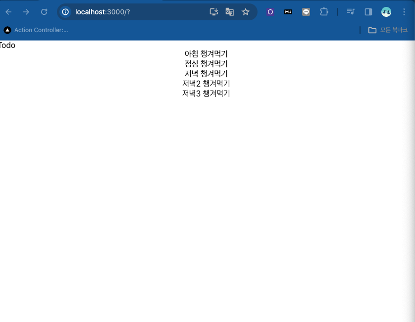
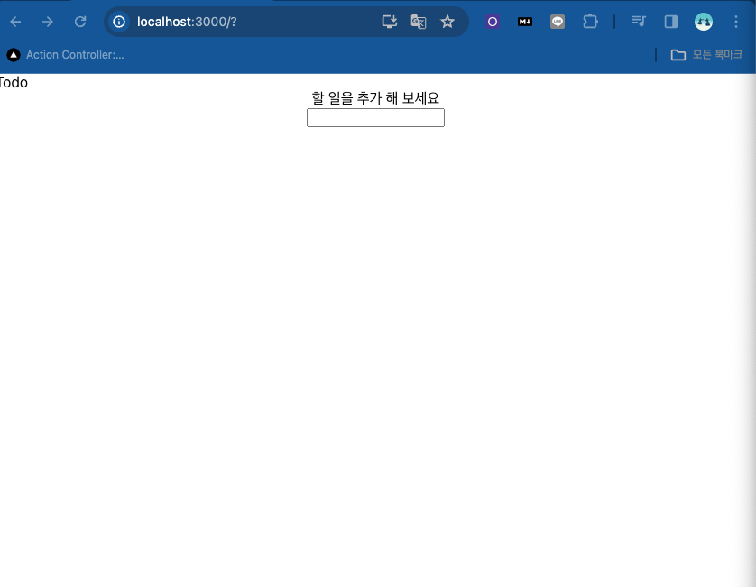

![]{}
$ npm create vite@latest
# Error 
>npm ERR! code ENOENT
npm ERR! syscall open

$ npm cache clean --force
$ npm i axios

$ npm init
$ npm install
$ 
# Error 
>'react-scripts'은(는) 내부 또는 외부 명령, 실행할 수 있는 프로그램, 또는
배치 파일이 아닙니다.
$ npm install -save react-scripts
# Error
[eslint] EPERM: operation not permitted, open 'H:\Coding\ZeroCho_TV\demo-app\node_modules\.cache\.eslintcache'
ERROR in [eslint] EPERM: operation not permitted, open 'H:\Coding\ZeroCho_TV\demo-app\node_modules\.cache\.eslintcache'
$ npm cache clean --force
$ npm install -g npm@latest --force

$ npm install --force
# 함수와 함수의 호출
  onChangeNewTodo={onChangeNewTodo()} 함수호출
  
webpack compiled with 1 error
# 표시하기 

## Java
>import logo from './logo.svg';
import './App.css';
import {useState} from 'react';

## jsx
>function App(){
    const [todo:undefined, setTodo] = useState(initialState[
         //  할일데이터는 todo 빠뀌는데이터는 setTodo   기본값은 배열에 
         // {객체}[배열] 
    {title: '아침 챙겨먹기' , completed:true}, 
            데이터           데이터가 바뀌는지 
    {title: '점심 챙겨먹기' , completed:false},
    {title: '저녁 챙겨먹기' , completed:false},
    ])     
    
    return (
        

        
{todo[0].title}

        
{todo[1].title}

        
{todo[2].title}
    
        

    );
>}
export default App;

# 조건, 반복문 

>import './App.css';
import {useState} from 'react';
function App(){
    const [todo, setTodo] = useState([
    {id:1, title: '아침 챙겨먹기' , completed:true},             
    {id:2, title: '점심 챙겨먹기' , completed:false},
    {id:3, title: '저녁 챙겨먹기' , completed:false},
    ]);
  return (
    <> {/* Fragment */} 주석 
    

     {
      todo.map((t) => (
{t.title}
))

      }    
    

>  );
>}
# 할 일이 없을때?

>import './App.css';
import {useState} from 'react';

>function App(){
    const [todo, setTodo] = useState([]);
         
    
    return (
        <>
        
Todo

        

          {todo.length === 0 ? (
          

            
할 일을 추가 해 보세요

            <input />
          

          ): (
            todo.map((t) => (
{t.title}
))
          )}
        
       
        </>
        
    );
>}

>export default App;
# 할일을 추가 해보는 것?
>function App() {
  const [todo, setTodo] = useState([ ]);
  const [newTodo, setNewTodo] = useState('')
  const onChangeNewTodo = (e) => {
    setNewTodo(e.target.value);
  }  
 
  return (
    <> {/* Fragment */}
      
TODO
      
      

        {todo.length === 0 ? (
          

            
할 일을 추가 해 보세요

            <input value={newTodo} onChange={onChangeNewTodo} />
          
          

        ): (
          <>
            {todo.map((t) => (
{t.title}
))}
            <input value={newTodo} onChange={onChangeNewTodo} />
          </>
          
        )}
       
      
    
    </>
    
  );
>}
# 버튼 추가
import './App.css';
import {useEffect, useState} from 'react';

function App(){
    const [todo, setTodo] = useState([]);
    const [newTodo, setNewTodo] = useState('');
         
    const onChangeNewTodo = (e) => {
        setNewTodo(e.target.value);
    }
    useEffect(() => {

    },[todo]);

    const onSubmit = (e) => {
    e.preventDefault();
    todo.push([{title: newTodo, completed:false, id: Math.random()}])
    const nextTodo = [...todo, {title:newTodo, completed:false, id:Math.random()}];
    setTodo(nextTodo);
    console.log(todo);
       
  }
       
    return (
        <>
        
Todo

        

          {todo.length === 0 ? (
          

            
할 일을 추가 해 보세요

            <form onSubmit={onSubmit}>
                <input value={newTodo} onChange={onChangeNewTodo} />
                <button>추가</button>
            </form>
            
          

          ): (
            <>
            {todo.map((t) => (
{t.title}
))}
            <form onSubmit={onSubmit}>
                <input value={newTodo} onChange={onChangeNewTodo} />
                <button>추가</button>
            </form>
            
            </>
          
          )}
        
       
        </>
        
    );
}
export default App;
# 
  function App() {
  const [todo, setTodo] = useState([ ]);
  const [newTodo, setNewTodo] = useState('')
  const onChangeNewTodo = (e) => {
    setNewTodo(e.target.value);
  } 
  const onSubmit = (e) => {
    e.preventDefault();
    setTodo([{title: newTodo, completed:false, id: Math.random()}])
    const nextTodo = [...todo, {title:newTodo, completed:false, id:Math.random()}];
    setTodo(nextTodo)
    todo   
  }
   
 
  return (
    <> {/* Fragment */}
      
TODO
      
      

        {todo.length === 0 ? (
          

            
할 일을 추가 해 보세요

            <form onSubmit ={onSubmit}>
              <input value={newTodo} onChange={onChangeNewTodo} />
              <button>추가</button>
            </form>
            
          

        ): (
          <>
            {todo.map((t) => (
{t.title}
))}
            <form onSubmit ={onSubmit}>
              <input value={newTodo} onChange={onChangeNewTodo} />
              <button>추가</button>
            </form>
          </>
          
        )}
       
      
    
    </>
    
  );
}
